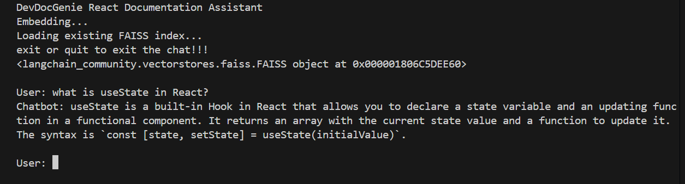
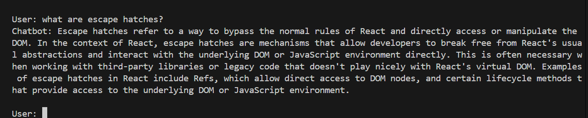
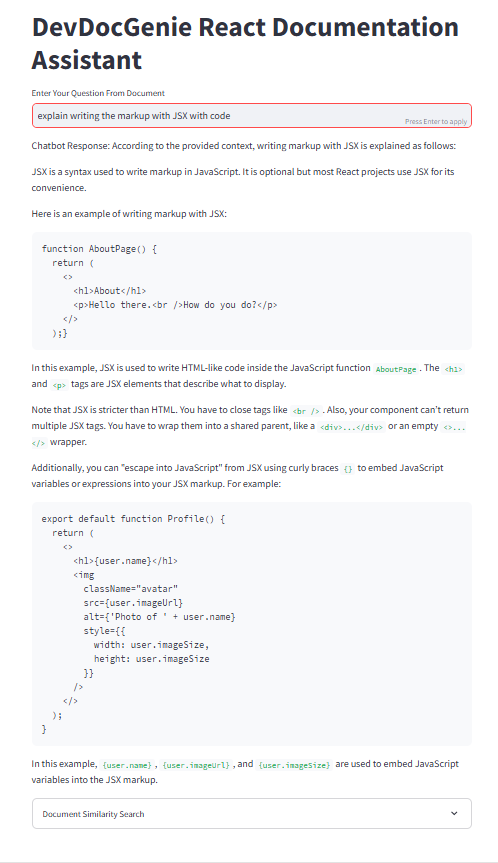
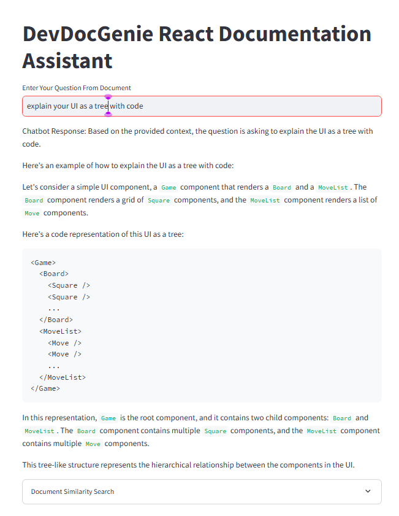

# **DevDocGenie React Documentaton Assistant **

## DevDocGenie is a Retrieval Augmented Generation (RAG) application which uses large language model to revolutionizes API documentation access for developers by addressing a critical gap in existing ##LLM-based AI tools. Traditional tools often rely on outdated versions of API documentation, which can be problematic given the rapid evolution of popular libraries and frameworks.

## This application uses the latest react documentation as a context to the Large Language Model.

## **Installation **

1. **Clone the Repository**:
   ```bash
   git clone https://github.com/Navise/devdocgenie.git
   cd devdocgenie
   ```

2. **Set up Environment**:
    ```bash
    python -m venv .venv
    .\.venv\Scripts\Activate
    ```

3. **Install the requirements**:
    ```bash
    pip install -r requirements.txt
    ```

4. **Configure API Keys**:
    Rename the .env.example file to .env.
    Add your Groq API key and Google API key to the .env file:
    ```bash
    GROQ_API_KEY=your_groq_api_key
    GOOGLE_API_KEY=your_google_api_key
    ```
5. **Run the Application**:

    **For Command Line Interface**:
    ```bash
    python clichat.py
    ```

    **For Streamlit Web GUI**:
    ```bash
    streamlit run chatapp.py
    ```

## **Usage**
1. Start the application by running the command above.
2. Type in your questions related to React documentation, and the chatbot will provide answers.
3. Type exit or quit to end the session.

## ** CLI Screenshot ** ##





## ** Streamlit webapp Screenshot ** ##






